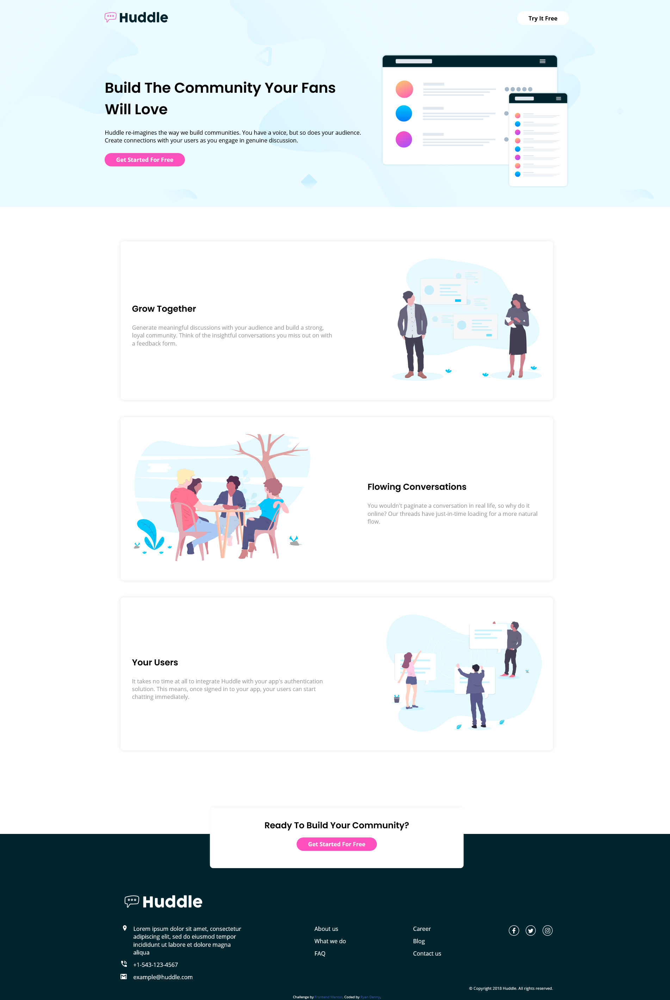

# Frontend Mentor - Huddle landing page with alternating feature blocks solution

This is a solution to the [Huddle landing page with alternating feature blocks challenge on Frontend Mentor](https://www.frontendmentor.io/challenges/huddle-landing-page-with-alternating-feature-blocks-5ca5f5981e82137ec91a5100). Frontend Mentor challenges help you improve your coding skills by building realistic projects. 

## Table of contents

- [Overview](#overview)
  - [The challenge](#the-challenge)
  - [Screenshot](#screenshot)
  - [Links](#links)
- [My process](#my-process)
  - [Built with](#built-with)
  - [What I learned](#what-i-learned)
  - [Continued development](#continued-development)
  - [Useful resources](#useful-resources)
- [Author](#author)

## Overview

### The challenge

Users should be able to:

- View the optimal layout for the site depending on their device's screen size
- See hover states for all interactive elements on the page

### Screenshot



### Links

- Solution URL: [https://www.frontendmentor.io/solutions/component-based-flexbox-layout-8Iitif9Q6](https://your-solution-url.com)
- Live Site URL: [https://crazeddoggo.github.io/FEM-Huddle-Landing-Page-Alternating-Blocks/](https://crazeddoggo.github.io/FEM-Huddle-Landing-Page-Alternating-Blocks/)

## My process

### Built with

- Semantic HTML5 markup
- CSS custom properties
- Flexbox
- Mobile-first workflow

### What I learned

I experimented with this design with a new component based system. Instead of going through and independently adding styles to each independent section such as flex, grid, or so on, classes were created to be applied in the mark-up where fit. This avoided repetition and created more "clean" code if you will.

In order to do this, I needed to plan out the site more compared to building it a simple top-down layout. I needed to analyze how a section or component should behave on multiple screen devices, and then find the similarities that all of those sections have. 

```css
.flex {
    display: flex;
}

.flex-col,
.footer-flex {
    flex-flow: column;
}

.flex-jb {
    justify-content: space-between;
}

.flex-al-c {
    align-items: center;
}

.m-wrap,
.wrap {
    flex-flow: wrap;
}
```

Is what I came up with. I decided to use flexbox for the entire site layout, and found that the above properties were the ones most commonly applied. I also created a m-wrap class for wrapping that only occurs on smaller screen resolutions. Of course, for certain elements such as my footer, I needed to give more independent styling due to how it behaved on different screen resolutions.

This was a *different* way to build sites than what I'm used to, but I thorougly enjoyed it and would be comfortable with this style.

### Continued development

I'll continue to use a few component based layouts where I find it needed, especially if a layout has very similar layouts for certain components. It just requires proper design, analysis, and planning.

## Author

- GitHub - [Ryan Denny](https://github.com/CrazedDoggo)
- Frontend Mentor - [@CrazedDoggo](https://www.frontendmentor.io/profile/CrazedDoggo)
- Twitter - [@DoggoCrazed](https://www.twitter.com/DoggoCrazed)
